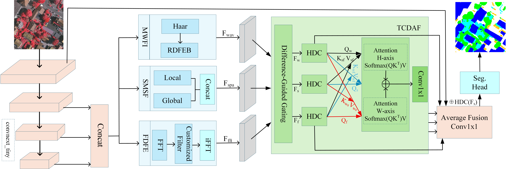

# DCross-Domain Alignment Fusion for Robust Remote Sensing Image Semantic Segmentation

[]()
[]()
[]()

Official implementation of **DFSAFNet** for remote sensing semantic segmentation.

---

## 📖 Overview

Semantic segmentation of high-resolution remote sensing images remains challenging due to complex spatial structures and frequency variations.  
We propose **DFSAFNet**, which integrates spatial-domain features and frequency-domain representations through an attention fusion mechanism to enhance segmentation performance.

---

## 🧠 Network Architecture



Key components:

- Frequency-domain feature extraction
- Dual-domain attention fusion
- Multi-scale feature aggregation
- Lightweight decoder design

---

## 📂 Dataset

We evaluate our method on:

- **ISPRS Potsdam**
- **ISPRS Vaihingen**
- **LoveDA**
- **UAVid**

Please download datasets from official websites.

---

## ⚙️ Installation

Create the environment and install dependencies:

```bash
conda create -n dfsafnet python=3.10
conda activate dfsafnet

git clone https://github.com/ziyanpeng/DFSAFNet.git
cd DFSAFNet

pip install -r requirements.txt
```

---

## 🚀 Training

To train DFSAFNet on the target dataset:Select a different config file

```bash
# potsdam
python DFSAFNet/train_supervision.py --DFSAFNet/config/potsdam/DFSAFNet.py

# Vaihingen
python DFSAFNet/train_supervision.py --DFSAFNet/config/vaihingen/DFSAFNet.py

# LoveDA
python DFSAFNet/train_supervision.py --DFSAFNet/config/loveda/DFSAFNet.py

# UAVid
python DFSAFNet/train_supervision.py --DFSAFNet/config/uavid/DFSAFNet.py
```

---

## 🚀 Testing

To evaluate a trained model:Select a different config file

```bash
# potsdam
python DFSAFNet/potsdam_test.py --DFSAFNet/config/potsdam/DFSAFNet.py

# Vaihingen
python DFSAFNet/vaihingen_test.py --DFSAFNet/config/vaihingen/DFSAFNet.py

# LoveDA
python DFSAFNet/loveda_test.py --DFSAFNet/config/loveda/DFSAFNet.py

# UAVid
python DFSAFNet/uavid_test.py --DFSAFNet/config/uavid/DFSAFNet.py
```

---


